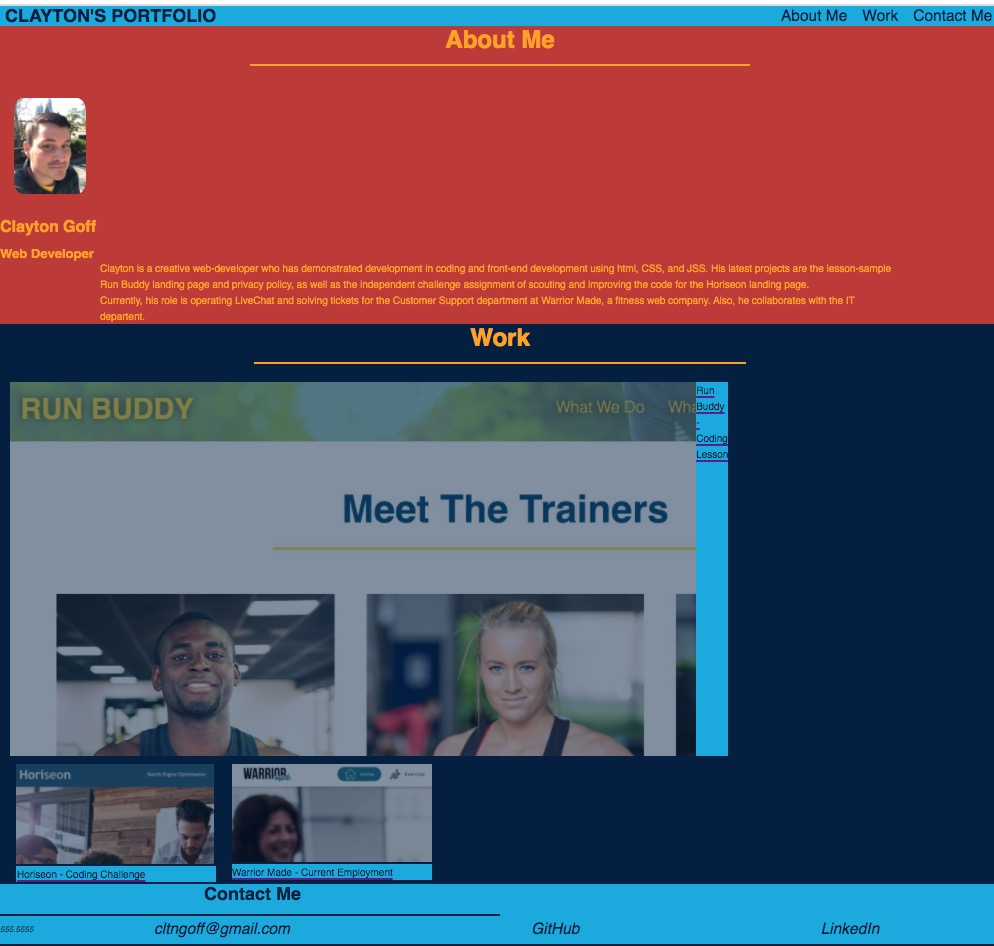
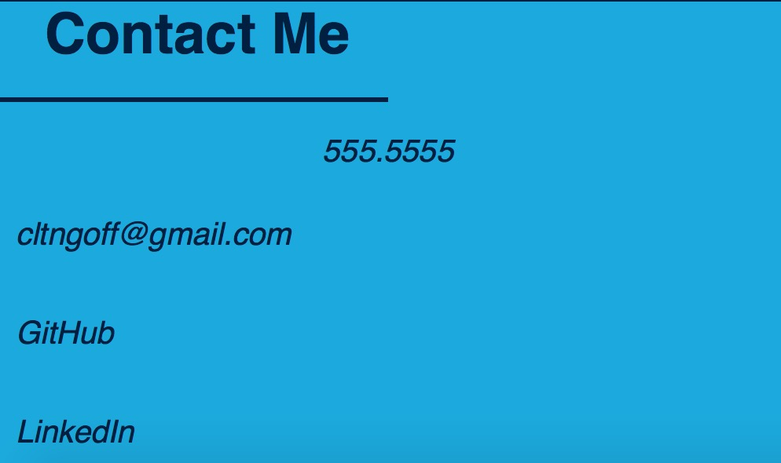

# professional-portfolio
​
## Description 
​
I'm Clayton Goff and this web page is designed to give me some experience using html and advanced CSS while meeting the criteria for UCB Bootcamp Challenge #2. This also serves to build my professional portfolio toward the goal of a career in web development.
​​
## Table of Contents (Optional)
​
If your README is very long, add a table of contents to make it easy for users to find what they need.
​
* [Installation](#installation)
* [Usage](#usage)
* [Credits](#credits)
* [License](#license)
​
​
## Installation
​
Please click on the URL and see the site at https://clayto30.github.io/professional-portfolio/

You should see the following desktop site:

​
## Usage 
​
When you load my portfolio page, you should find that it loads without problems. First, you'll notice a picture of me! Please use the navigation links to travel to the various sections inlcuding one about, another featuring images that link to my projects, and my contact information.

I used two examples from class of projects I've worked on as a lesson and as a challenge. The first is the lesson, Run Buddy landing page. I built this page step by step with detailed instruction in the course material. The second is a page that I was tasked with scouting code, fixing links, and improving code. The final is a website that I have not contributed dev work to, but I am currently employed there in a customer support role. I thought it would be useful to add some content to the page.

​I did not reach a completely satisfactory layout. I wish I could improve the images that link to projects and their titles. I wish I could improve the section title for contact me. Further work is required, but time does not allow! I could also scout and improve the code greatly, given time.

For responsiveness, I add a feature that made the text not get too small on smaller screen resolutions. Please take a look at this screenshot which demonstrates this responsiveness:

## Credits
​
Run Buddy was created with the instruction of UCBerkeley Extension's private course modules.

The Horiseon landing page is also provided with instructions for completion from the same program as above.

The Warrior Made website is copyright Warrior Made 2020.
​
## License
​
Copyright (c) 2021 Clayton Goff

Permission is hereby granted, free of charge, to any person obtaining a copy
of this software and associated documentation files (the "Software"), to deal
in the Software without restriction, including without limitation the rights
to use, copy, modify, merge, publish, distribute, sublicense, and/or sell
copies of the Software, and to permit persons to whom the Software is
furnished to do so, subject to the following conditions:

The above copyright notice and this permission notice shall be included in all
copies or substantial portions of the Software.

Feel free to reach out to me with job offers as a web developer! 

THE SOFTWARE IS PROVIDED "AS IS", WITHOUT WARRANTY OF ANY KIND, EXPRESS OR
IMPLIED, INCLUDING BUT NOT LIMITED TO THE WARRANTIES OF MERCHANTABILITY,
FITNESS FOR A PARTICULAR PURPOSE AND NONINFRINGEMENT. IN NO EVENT SHALL THE
AUTHORS OR COPYRIGHT HOLDERS BE LIABLE FOR ANY CLAIM, DAMAGES OR OTHER
LIABILITY, WHETHER IN AN ACTION OF CONTRACT, TORT OR OTHERWISE, ARISING FROM,
OUT OF OR IN CONNECTION WITH THE SOFTWARE OR THE USE OR OTHER DEALINGS IN THE
SOFTWARE.